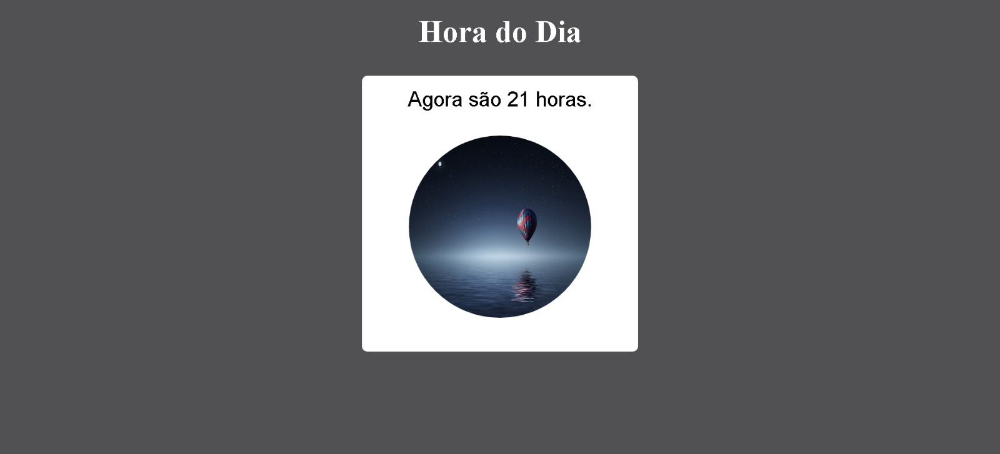

 #  
 <a href="https://lapiedradaniel.github.io/Hora-do-Dia/" target="_blank"> Uma Jornada Visual pelas Horas do Dia <a/>

 

<h1>
        
</h1>

Este projeto interativo, intitulado "Uma Jornada Visual pelas Horas do Dia", proporciona uma experiência visual única ao exibir uma mensagem dinâmica e alterar uma imagem de fundo com base nas principais horas do dia: manhã, tarde e noite. A interface simples e agradável se adapta conforme as diferentes fases do dia, oferecendo uma jornada visual envolvente.

<h1>Como Funciona</h1>
Ao carregar a página, o script JavaScript calcula a hora atual e ajusta dinamicamente a mensagem para refletir o horário do dia. Além disso, a imagem de fundo é trocada de acordo com a fase do dia, criando uma experiência visual imersiva.
<h3>Estrutura do Projeto</h3>
O projeto é composto por três arquivos principais:

- index.html: Define a estrutura da página, incorpora os estilos e scripts necessários, e exibe a mensagem e a imagem de fundo.

- style.css: Fornece estilos e formatação para garantir uma apresentação visual agradável e responsiva.

- script.js: Contém a lógica de interação com o usuário, calcula a hora atual e ajusta dinamicamente a mensagem e a imagem de fundo.

 
<h2>Acesse o Site</h2>
Explore "Uma Jornada Visual pelas Horas do Dia" <a href="https://lapiedradaniel.github.io/Hora-do-Dia/" target="_blank"> clicando aqui<a/>
 para vivenciar essa jornada visual única pelas horas do dia.

<h2>Tecnologias Utilizadas</h2>

- HTML 
- CSS
- JavaScript
 Essenciais para o desenvolvimento da interface amigável e interativa do "Clima Agora".

 
  
  
          

